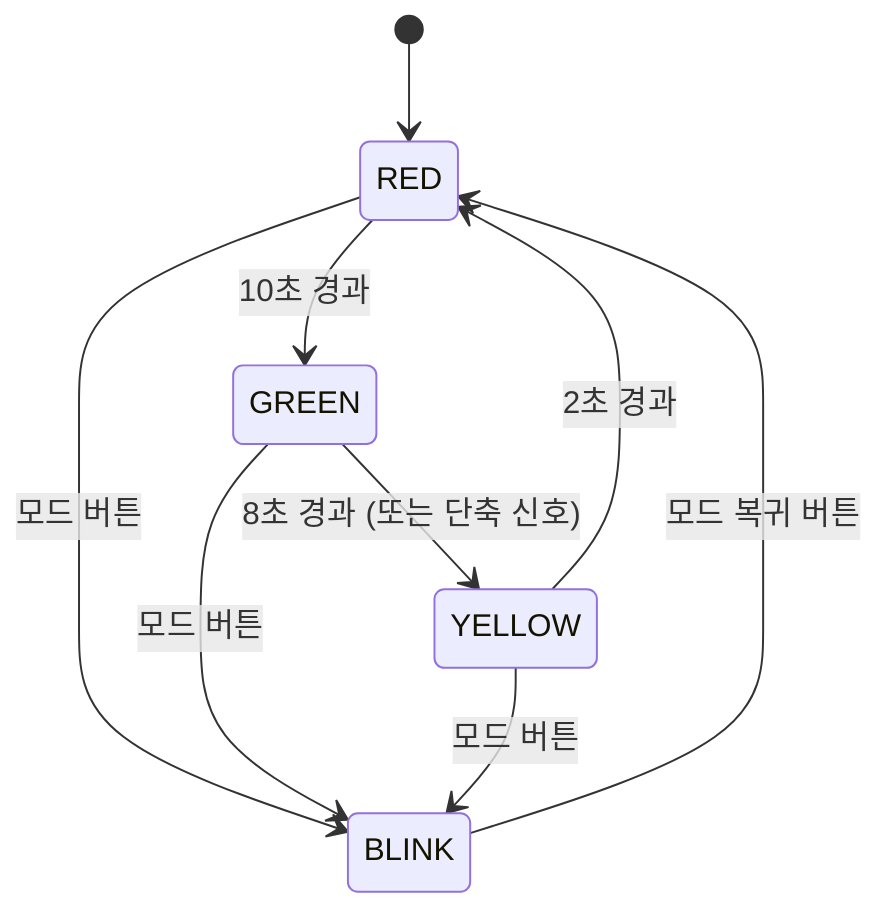

# 교통 신호등 제어기 설계 명세서

본 문서는 Verilog HDL을 이용한 교통 신호등 제어기의 설계 요구사항과 시스템 구조를 정의합니다.

---

## 1. 기본 요구사항

-   **상태 순환:** `RED` → `GREEN` → `YELLOW` → `RED` 순서로 상태가 순차적으로 변경됩니다.
-   **시간 유지:** 각 상태는 아래에 정의된 시간 동안 유지됩니다.
    -   **RED:** 10초
    -   **GREEN:** 8초
    -   **YELLOW:** 2초
-   **특수 모드:** 긴급 상황이나 심야 시간대를 위한 `BLINK`(깜박임) 모드를 지원합니다.
-   **안정성:** 시스템 재시작 등 예기치 못한 조건에서도 항상 `RED` 상태로 진입하여 안전을 확보합니다.

---

## 2. 시스템 동작 상세 시나리오


| 상태 (State) | 지속 시간 | LED 출력 | 다음 상태 (Next State) | 특수 조건 |
| :--- | :--- | :--- | :--- | :--- |
| **RED** | 10초 | `RED`=ON, `GREEN`=OFF, `YELLOW`=OFF | `GREEN` | 긴급 모드(`BLINK`) 진입 가능 |
| **GREEN** | 8초 | `RED`=OFF, `GREEN`=ON, `YELLOW`=OFF | `YELLOW` | 시간 단축 신호 입력 시 즉시 `YELLOW`로 변경 가능 |
| **YELLOW** | 2초 | `RED`=OFF, `GREEN`=OFF, `YELLOW`=ON | `RED` | 상태 변경 불가 |
| **BLINK** | 무기한 | `RED`와 `YELLOW`가 1초 간격으로 교차 점멸 | `RED` | 모드 복귀 버튼 입력 시 `RED` 상태로 복귀 |

*참고: GREEN 상태의 LED 출력은 일반적인 신호등 동작을 기준으로 `RED=OFF, GREEN=ON`으로 명시했습니다.*

---

## 3. 시스템 구조 (Verilog 구현 구상)

시스템은 표준적인 상태 머신(FSM) 구조를 따르며, 기능에 따라 3개의 `always` 블록으로 역할을 분리하여 설계합니다.

### 블록 1: 상태 및 타이머 업데이트 (순차 회로)

-   **역할:** 클럭 신호(`clk`)에 맞춰 현재 상태(`curr_state`)와 타이머(`count`) 값을 업데이트합니다. 리셋(`rst`) 신호에 반응하여 시스템을 초기화합니다.
-   **구현:** `always @(posedge clk, posedge rst)`

```verilog
// 블록 1: 상태 및 타이머 업데이트용 순차 회로
always @(posedge clk, posedge rst) begin
    if (rst) begin
        curr_state <= RED;
        count <= 0;
    end
    else begin
        curr_state <= next_state;
        // 타이머 로직: 상태가 변경되면 count를 리셋하고, 아니면 증가
        if (next_state != curr_state) begin
            count <= 0;
        end
        else begin
            count <= count + 1;
        end
    end
end
```

### 블록 2: 다음 상태 결정 (조합 회로)

-   **역할:** 현재 상태(`curr_state`)와 타이머(`count`), 그리고 외부 입력(모드 버튼 등)을 바탕으로 다음에 어떤 상태(`next_state`)로 가야 할지 결정합니다.
-   **구현:** `always @(*)`

```verilog
// 블록 2: 다음 상태 결정을 위한 조합 회로
always @(*) begin
    next_state = curr_state; // 기본적으로 현재 상태 유지
    case (curr_state)
        RED: begin
            if (count >= RED_DURATION) begin
                next_state = GREEN;
            end
        end
        GREEN: begin
            if (count >= GREEN_DURATION) begin
                next_state = YELLOW;
            end
        end
        YELLOW: begin
            if (count >= YELLOW_DURATION) begin
                next_state = RED;
            end
        end
        BLINK: begin
            // 모드 복귀 버튼 입력 시 RED로 변경
        end
    endcase
end
```

### 블록 3: LED 출력 결정 (조합 회로)

-   **역할:** 현재 상태(`curr_state`)에 따라 어떤 LED를 켤지(`RED`, `GREEN`, `YELLOW` 출력 값) 결정합니다.
-   **구현:** `always @(*)`

```verilog
// 블록 3: LED 출력을 결정하기 위한 조합 회로
always @(*) begin
    // 기본적으로 모든 LED는 OFF
    RED_LED = 1'b0;
    GREEN_LED = 1'b0;
    YELLOW_LED = 1'b0;

    case (curr_state)
        RED:    RED_LED = 1'b1;
        GREEN:  GREEN_LED = 1'b1;
        YELLOW: YELLOW_LED = 1'b1;
        BLINK: begin
            // 1초 간격 점멸 로직
        end
    endcase
end
```

---

## 4. 상태 전이도 (State Diagram)


